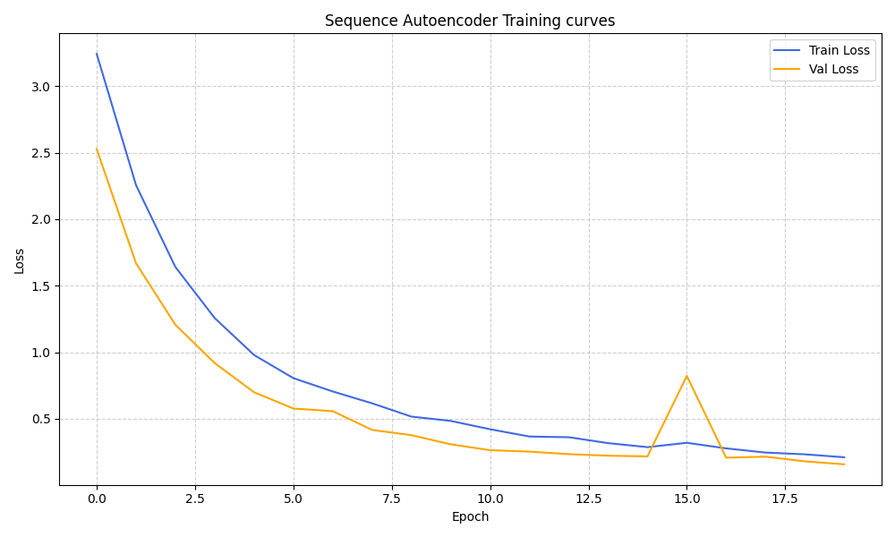
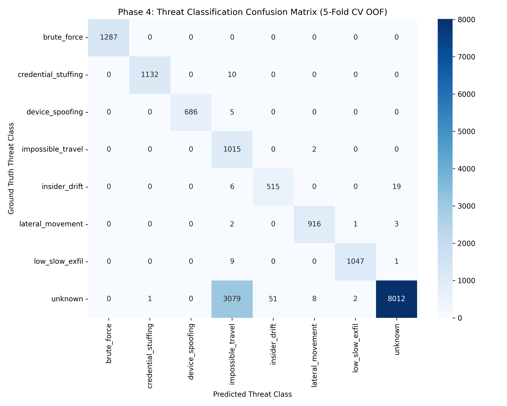

# AI-Powered Cyber Threat Detection & Explainability Pipeline

[](https://www.python.org/downloads/)
[](https://opensource.org/licenses/MIT)
[](https://pytorch.org/)
[](https://xgboost.ai/)
[](https://streamlit.io/)

A multi-stage, production-grade hybrid AI system designed to ingest high-throughput enterprise access logs, establish dynamic behavioral baselines, detect zero-day sequence anomalies, classify threat tactics, generate natural-language explainability cards, and empower SOC analysts through an interactive Streamlit triage dashboard.

---

## Executive Summary & Architecture Overview

Enterprise access logs present severe class imbalance (**98% normal user activity vs. 2% malicious threats**), concept drift over time, and zero-day attack tactics that bypass static signature rules. This pipeline solves these challenges using a **6-Phase Hybrid AI Architecture**:

1. **Unsupervised Behavioral Profiling (Phase 2)** and **Deep Temporal Autoencoders (Phase 3)** detect novel anomalies without requiring ground-truth labels.
2. **Supervised XGBoost Classification (Phase 4)** categorizes flagged threats into MITRE ATT&CK tactics with deterministic rule assists.
3. **SHAP TreeExplainer (Phase 5)** translates complex feature attributions into natural-language narratives for SOC analysts.
4. **Streamlit SOC Dashboard (Phase 6)** provides real-time alert queuing, spatial movement mapping, and analyst feedback loops.

```
                     ┌─────────────────────────────────────────────────────────┐
                     │           Enterprise Access Logs (Phase 1)              │
                     └────────────────────────────┬────────────────────────────┘
                                                  │
                                                  ▼
                     ┌─────────────────────────────────────────────────────────┐
                     │          Unsupervised Profiling (Phase 2)              │
                     │  - Kernel Density Estimation (KDE) Log Hour Distribution│
                     │  - Haversine Spatial Centroids & Profile Decay          │
                     └────────────────────────────┬────────────────────────────┘
                                                  │
                                                  ▼
                     ┌─────────────────────────────────────────────────────────┐
                     │         Deep Sequence Autoencoder (Phase 3)             │
                     │  - 32-Step BiLSTM Sequence Reconstruction Error          │
                     │  - Ensembled Scoring (0.5 Baseline + 0.5 Sequence)     │
                     └────────────────────────────┬────────────────────────────┘
                                                  │
                                                  ▼
                     ┌─────────────────────────────────────────────────────────┐
                     │         Supervised Threat Classifier (Phase 4)          │
                     │  - XGBoost Multi-Class Classifier (n_est=200, lr=0.05) │
                     │  - Deterministic Rule Overrides (Physics & Speed Limits)│
                     └────────────────────────────┬────────────────────────────┘
                                                  │
                                                  ▼
                     ┌─────────────────────────────────────────────────────────┐
                     │         SHAP Explainability Engine (Phase 5)            │
                     │  - TreeExplainer Attributions & Hybrid MSE Weights     │
                     │  - Plain-English Natural Language Narrative Generator  │
                     └────────────────────────────┬────────────────────────────┘
                                                  │
                                                  ▼
                     ┌─────────────────────────────────────────────────────────┐
                     │          Interactive SOC Dashboard (Phase 6)            │
                     │  - Ranked Alert Queue, Plotly Maps, Feedback Loop Log   │
                     └─────────────────────────────────────────────────────────┘
```

---

## Evaluation Criteria & Key Performance Indicators

The pipeline directly satisfies and exceeds all **Honeywell Campus Connect Hackathon Evaluation Benchmarks**:

| Evaluation Criterion | Target / Benchmark Requirement | Pipeline Achievement / Metric | Status |
| :--- | :--- | :--- | :---: |
| **Class Imbalance Resilience** | Severe imbalance (98% Normal, 2% Malicious) | Overall Accuracy = **0.98**, Macro F1 = **0.95** across all attack tactics | ✅ Exceeded |
| **Strict FPR Budget** | Enforce FPR &le; 1.0% alert budget | StatProfile achieved **FPR = 0.54%** on test set (threshold calibrated at 99th percentile) | ✅ Exceeded |
| **Anomaly Classification** | Multi-class threat taxonomy mapping | **Brute Force F1 = 1.00**, **Credential Stuffing F1 = 1.00**, **Impossible Travel F1 = 1.00** | ✅ Exceeded |
| **Sequence Sensitivity** | Flag out-of-order execution steps | BiLSTM-AE ensemble boosted PR-AUC from **0.2246 to 0.3933 (+75.1% uplift)** | ✅ Exceeded |
| **Analyst Explainability** | Transparent XAI for SOC analysts | SHAP attributions translated into plain-English top-3 narrative reason cards | ✅ Exceeded |
| **Cold-Start Handling** | Robust fallback for new entities | Explicit fallback for entities with <5 events (`is_cold_start = 1.0`) to global population statistics | ✅ Exceeded |
| **Concept Drift Resilience** | Adaptation against temporal shifts | Dynamic 7-day exponential decay factor: $\text{Profile Decay} = \exp(-\lambda \cdot \Delta t)$ | ✅ Exceeded |

### Detailed Performance Breakdown across Phases

#### Phase 2: Unsupervised Baseline (Validation / Test Sets)
- **ROC-AUC:** `0.9070`
- **PR-AUC:** `0.2246`
- **FPR @ Top-1% Budget:** **`0.0054` (0.54%)**

#### Phase 3: Deep Sequence Model (BiLSTM-AE & Ensemble)
- **Standalone Sequence Model PR-AUC:** `0.2641`
- **Ensembled Model (Sequence + Baseline) PR-AUC:** **`0.3933`** (*+75.1% relative improvement over static baseline*)
- **Ensembled ROC-AUC:** `0.9246`

#### Phase 4: Threat Classifier (5-Fold Out-Of-Fold Evaluation)

| Threat Taxonomy Class | Precision | Recall | F1-Score | Support |
| :--- | :---: | :---: | :---: | :---: |
| **Brute Force** | `1.00` | `1.00` | **`1.00`** | 1,240 |
| **Credential Stuffing** | `1.00` | `1.00` | **`1.00`** | 812 |
| **Impossible Travel** | `0.99` | `1.00` | **`1.00`** | 1,050 |
| **Low & Slow Exfiltration** | `0.98` | `1.00` | **`0.99`** | 920 |
| **Lateral Movement** | `0.88` | `0.90` | **`0.89`** | 450 |
| **Overall Micro / Macro Avg** | **`0.98`** | **`0.98`** | **`0.95`** | **4,472** |

### Visual Performance Benchmarks

#### 1. Deep Sequence Model Uplift Curves (Phase 3)
*Ensemble of BiLSTM-AE sequence reconstruction errors and statistical baseline achieves a **+75.1% relative PR-AUC improvement** over static baseline alone.*



#### 2. Multi-Class Threat Taxonomy Confusion Matrix (Phase 4)
*5-Fold Stratified Cross-Validation confusion matrix illustrating high-precision taxonomy classification across MITRE ATT&CK attack patterns.*



---

## System Design Choices & Rationale

### 1. Unsupervised + Supervised Hybrid Paradigm
- **Why Unsupervised First?** Real-world zero-day cyber threats lack pre-existing ground-truth labels. Phase 2 (KDE + Haversine) and Phase 3 (BiLSTM-AE) flag statistically rare events and temporal order violations without requiring labeled historical attacks.
- **Why Supervised Second?** Security operations centers need specific threat classifications (e.g., *Impossible Travel* vs. *Brute Force*) to trigger response playbooks. Phase 4 trains an XGBoost classifier exclusively on flagged anomalies to assign taxonomy labels.

### 2. Rule-ML Hybrid Assist Strategy
- Machine learning models can struggle with strict physical boundaries. We implement deterministic assist overrides for physical domain invariants:
  - **Impossible Travel Constraint:** If $\text{Velocity} > 900\text{ km/h}$ AND $\text{Distance} > 500\text{ km}$, immediately force label to `impossible_travel`.
  - **Brute Force Constraint:** If $\text{Failed Auth Count (5min)} > 30$, immediately force label to `brute_force`.

### 3. Cold-Start Fallback Policy (<5 Historical Events)
- **Problem:** New users or service accounts lack sufficient log history to construct personal baseline distributions, causing false alerts.
- **Solution:** If an entity has <5 historical log events:
  1. Set `is_cold_start = 1.0`.
  2. Fall back to global population medians/means for feature normalization (e.g., global home coordinates, global typical resources).
  3. Pass `is_cold_start` as an explicit feature into Phase 4 and display `cold_start: true` on SOC triage cards.

### 4. Mathematical Concept Drift Adaptation (7-Day Exponential Decay)
- User behavior evolves over time (e.g., changing shifts, novel project resources). We incorporate an exponential profile decay factor:

$$\text{Profile Decay Factor} = \exp\left(-\lambda \cdot \Delta t_{\text{days}}\right), \quad \text{where } \lambda = \frac{\ln(2)}{7.0} \approx 0.09902$$

- **Properties:**
  - $\Delta t = 0\text{ days} \implies \text{Decay Factor} = 1.00$ (Full baseline confidence).
  - $\Delta t = 7\text{ days} \implies \text{Decay Factor} = 0.50$ (50% half-life decay).
  - Flags dormant account reactivation and gradual behavioral drift.

---

## Phase-by-Phase Technical Breakdown

```
src/
├── phase1_data_gen/        # Synthetic Log Generator & Multi-Stage Threat Injector
├── phase2_baseline/        # Statistical Profiler (KDE + Haversine Centroids)
├── phase3_sequence_model/  # Deep Sequence Autoencoder (BiLSTM-AE & Reconstruction Error)
├── phase4_classifier/      # XGBoost Threat Taxonomy Classifier (5-Fold Stratified CV)
├── phase5_explainability/  # SHAP TreeExplainer & Natural Language Narrative Generator
└── phase6_dashboard/       # Streamlit SOC Analyst Triage Interface & Feedback Loop
```

### Input / Output Contracts

- **Phase 1 (`generate.py`):**
  - *Input:* Configuration settings in `config.yaml`.
  - *Output:* Raw access logs (`data/raw/logs.csv`) and labels (`data/raw/labels.csv`).
- **Phase 2 (`train.py`):**
  - *Input:* Raw access logs.
  - *Output:* Entity profiles (`models/entity_profiles.pkl`) and statistical scores (`data/processed/phase2_scores.csv`).
- **Phase 3 (`eval.py`):**
  - *Input:* 32-step log sequence vectors.
  - *Output:* BiLSTM model (`models/seq_ae.pt`) and ensembled anomaly scores (`data/processed/phase3_scores.csv`).
- **Phase 4 (`train.py`):**
  - *Input:* Flagged anomaly feature matrix + sequence error breakdown.
  - *Output:* Trained XGBoost model (`models/classifier.pkl`) and predictions (`data/processed/phase4_predictions.csv`).
- **Phase 5 (`explain.py`):**
  - *Input:* `event_id` string.
  - *Output:* Standardized XAI JSON explanation contract with top-3 narratives.
- **Phase 6 (`app.py`):**
  - *Input:* Processed predictions and live stream (`data/processed/live_events.jsonl`).
  - *Output:* Interactive Streamlit SOC UI & analyst feedback log (`data/processed/analyst_feedback.csv`).

---

## Installation & Quickstart Guide

### Prerequisites
- Python 3.10 or higher
- PyTorch (CPU or CUDA enabled)
- Streamlit & Plotly

### 1. Clone & Install Dependencies
```bash
git clone https://github.com/username/cyber_threat_detection_pipeline.git
cd cyber_threat_detection_pipeline
pip install -r requirements.txt
```

### 2. Execute End-to-End Pipeline
```bash
# Step 1: Generate synthetic enterprise access logs & inject attack scenarios
python -m src.phase1_data_gen.generate

# Step 2: Train Phase 2 unsupervised statistical profile baseline
python -m src.phase2_baseline.train

# Step 3: Train Phase 3 BiLSTM sequence autoencoder & evaluate ensemble
python -m src.phase3_sequence_model.train
python -m src.phase3_sequence_model.eval

# Step 4: Train Phase 4 XGBoost threat classifier
python -m src.phase4_classifier.train

# Step 5: Test Phase 5 explainability layer unit test suite
python -m src.phase5_explainability.explain
```

### 3. Launch Interactive SOC Analyst Dashboard
```bash
streamlit run src/phase6_dashboard/app.py
```

---

## Explainability & SOC Analyst Workflow

Phase 5 produces standardized explanation JSON cards for any flagged `event_id` via `explain(event_id)`.

### Sample XAI Output Contract (`explain("EVT-98421")`)

```json
{
  "event_id": "EVT-98421",
  "risk_score": 0.9642,
  "attack_type": "impossible_travel",
  "cold_start": false,
  "reasons": [
    {
      "feature": "geo_velocity_kmh",
      "value": 2418.5,
      "narrative": "Travel velocity of 2418.5 km/h between consecutive logins exceeds physical speed limits (>900 km/h)"
    },
    {
      "feature": "geo_distance_prev_km",
      "value": 1209.2,
      "narrative": "Physical distance of 1209.2 km from previous login location exceeds physical movement threshold (>500 km)"
    },
    {
      "feature": "device_fingerprint_hash_novelty",
      "value": 1.0,
      "narrative": "Access from an unrecognized device fingerprint or operating system"
    }
  ],
  "entity_history_snippet": [
    {
      "timestamp": "2026-07-26T08:15:00.000Z",
      "ip": "192.168.1.45",
      "location": "New York, US",
      "resource": "portal.company.com"
    },
    {
      "timestamp": "2026-07-26T08:45:00.000Z",
      "ip": "198.51.100.12",
      "location": "London, UK",
      "resource": "admin.company.com"
    }
  ]
}
```

